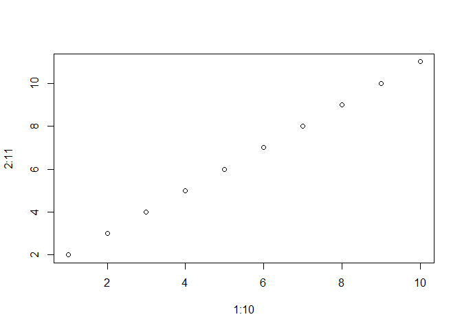

# Prueba de R Markdown
David Palomeque Mangut  
1 de octubre de 2016  

Operaciones matemáticas de prueba.

```r
a = 3 + 3
b = 4
a*b
```

```
## [1] 24
```

Plot random

```r
plot(1:10, 2:11)
```

<!-- -->


